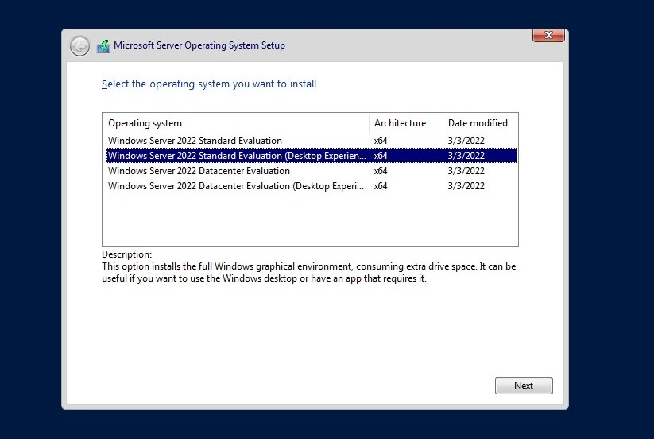

# Baixando o servidor windows
Após iniciarmos a [maquina virtual](https://github.com/gaamarchi/Windows_Server/blob/main/baixando_servidor/criando_vm.md) e esperar ela carregar iremos parar na seguinte tela:  

   
  selecione o layout do seu keybord e clique em next   
  clicamos em install e esperamos 
  vamos para a seguinte tela 

    
para este curso iremos selecionar  a versão standard com Desktop experience e clicamos em next